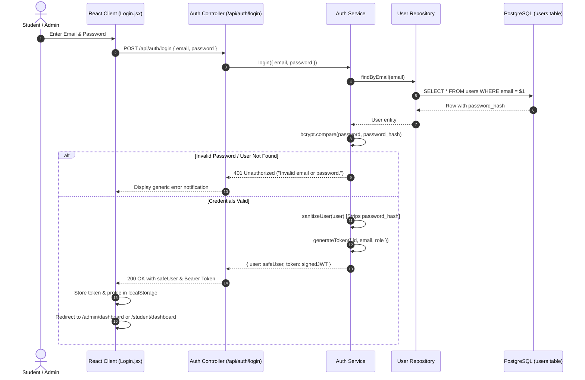
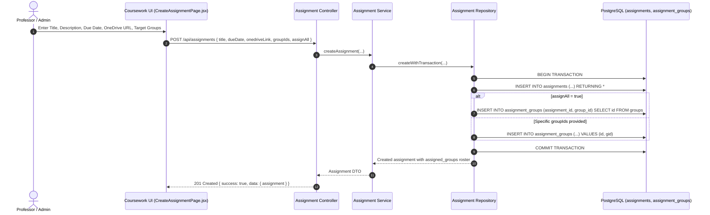
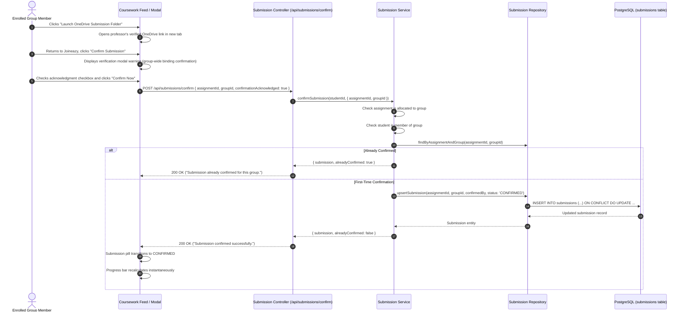

# Joineazy Core Data Flows & Business Processes

This document details the lifecycle and sequence of key data flows across the system.

---

## 1. Authentication & Session Lifecycle

---

## 2. Student Group Management Flow

1. **Group Creation**:
   - `POST /api/groups { name }`
   - Authenticated student ID is passed to `group.service.js`.
   - `group.repository.js` executes an atomic SQL transaction: inserts into `groups` table, then inserts the creator into `group_members` with `joined_at = CURRENT_TIMESTAMP`.
   - Returns `{ group, member_count: 1, is_creator: true }`.

2. **Member Addition**:
   - `POST /api/groups/:id/members { email | studentId }`
   - Object-level authorization checks: Is requester a member of the group?
   - Target student resolution: Fetches student by institutional email or student ID. Rejects admins (`role !== 'STUDENT'`).
   - Duplicate membership check: Prevents duplicate addition (`409 Conflict`).
   - Inserts member into `group_members`.

3. **Member Removal & Self-Leave**:
   - `DELETE /api/groups/:id/members/:studentId`
   - Creator Anchor Protection: Group creator cannot be removed from the group (`400 Bad Request`).
   - Object authorization: Only group creators can remove other members. Regular members may only remove themselves.

---

## 3. Assignment Distribution & Allocation Flow

---

## 4. Two-Step Student Submission Confirmation Flow

---

## 5. Dynamic Progress Calculation & Monitoring Flow

Group progress is calculated dynamically in SQL without stale duplicate counters:

$$\text{Progress Percentage} = \begin{cases} 0\% & \text{if Total Coursework} = 0 \\ \operatorname{round}\left(\frac{\text{Completed Assignments}}{\text{Total Assigned Coursework}} \times 100\right) & \text{otherwise} \end{cases}$$

1. **Student Dashboard Progress**: Evaluated strictly for the student's enrolled groups.
2. **Admin Monitoring**: Roster of all groups with real-time status pills (`NOT_STARTED`, `IN_PROGRESS`, `COMPLETED`).
3. **Student-Wise Monitoring**: Matrix distinguishing the individual student who clicked confirm (`is_confirmer = true`) from other group teammates covered by the group delivery.

---

## 6. Real-Time Analytics Aggregation Flow

- **`GET /api/analytics/overview`**: Single-statement aggregation calculating institutional totals:
  - `totalStudents`
  - `totalGroups`
  - `totalAssignments`
  - `totalAssignedGroups`
  - `confirmedSubmissions`
  - `pendingSubmissions`
  - `overallCompletionPercentage`
- **`GET /api/analytics/assignments`**: Computes completion percentages per coursework item across allocated groups.
- **`GET /api/analytics/groups`**: Computes group performance percentages ($0\% \to 100\%$) across assigned coursework.
- **`GET /api/analytics/recent-submissions`**: Feed of recent confirmed submissions supporting multi-criteria filtering by assignment, group, and status.
