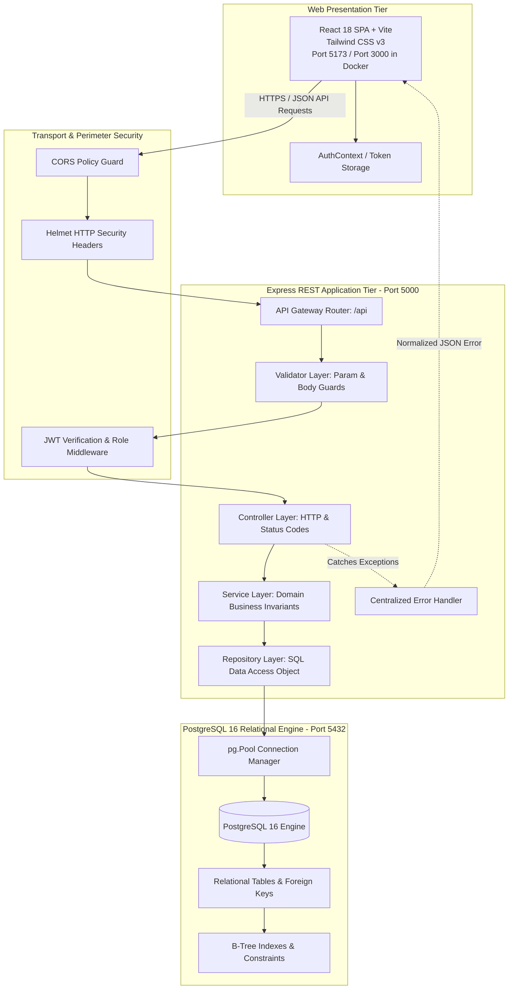
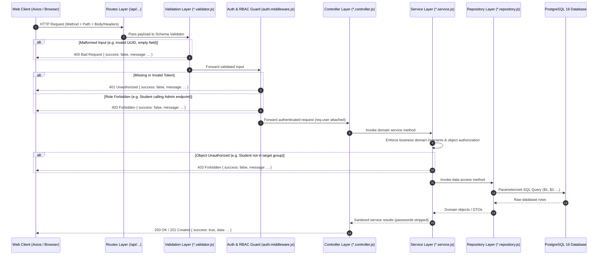
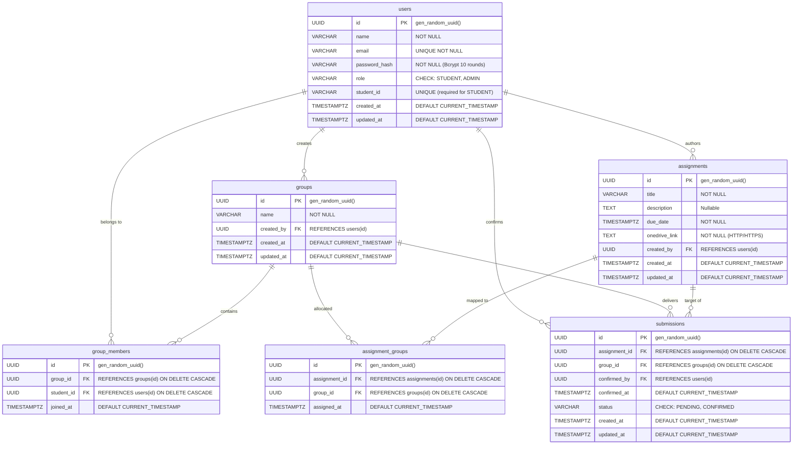

# Joineazy System Architecture Overview

## 1. High-Level Enterprise Architecture

The Joineazy Academic Management System is structured as a modern decoupled full-stack platform consisting of a React Single Page Application (SPA), a layered Express.js REST API, and a relational PostgreSQL database.

---

## 2. Backend Layered Architecture

To guarantee separation of concerns, testability, and maintainability, the backend enforces a strict **6-tier layered design**:

### Layer Responsibilities

| Tier | Directory | Responsibilities |
|---|---|---|
| **Routes** | `backend/src/routes/` | Declares URL routing tree, HTTP verbs, and mounts middleware chains. |
| **Validators** | `backend/src/validators/` | Sanitizes strings, validates UUID parameters, checks field lengths, enforces URL schemas. |
| **Middleware** | `backend/src/middleware/` | JWT token decoding, role-based authorization guards, structured HTTP logging, centralized error handling. |
| **Controllers** | `backend/src/controllers/` | Translates HTTP requests into service calls, maps status codes (`200`, `201`, `400`, `401`, `403`, `404`, `409`), returns uniform JSON. |
| **Services** | `backend/src/services/` | Encapsulates business logic, data sanitization (stripping password hashes), object-level authorization, and workflow orchestration. |
| **Repositories** | `backend/src/repositories/` | Direct data-access abstraction layer executing parameterized SQL queries against the PostgreSQL connection pool. |

---

## 3. Relational Database Schema & ER Diagram

The database utilizes standard relational normalization with strict foreign key constraints, unique constraints, and B-Tree indexes:

---

## 4. Frontend Architecture

- **SPA Foundation**: React 18 + Vite 5 + Tailwind CSS v3 with responsive UI components.
- **Client Routing**: `react-router-dom` v6 with declarative `<ProtectedRoute allowedRoles={...}>` wrapping role-gated routes.
- **State Management**:
  - `AuthContext`: Centralized authentication provider managing JWT persistence in `localStorage`, user session state, and automated authorization header injection.
  - Page-level and component-level reactive hooks (`useState`, `useEffect`, `useCallback`) for real-time dashboards and charts.
- **Data Visualization**: Pure responsive SVG charts (Donut Chart for submission status, Horizontal Bar charts for assignment completion and group ranking) ensuring zero external charting bloat, high rendering performance, and complete responsiveness across mobile, tablet, and desktop breakpoints.
