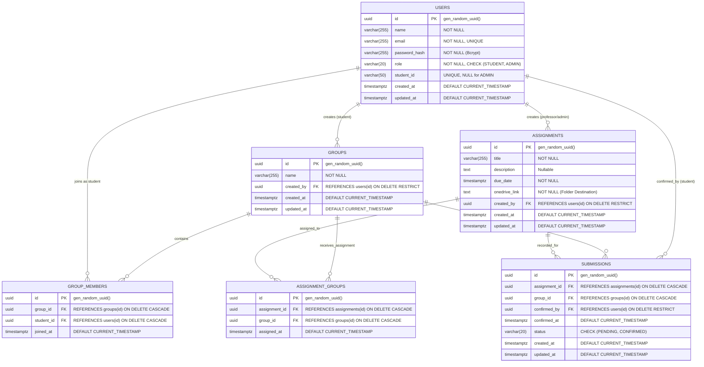

# Joineazy Database Architecture & Relational Data Model

**Application**: Joineazy Student, Group & Assignment Management System  
**Engine**: PostgreSQL 16+  
**Phase**: Phase 2 — Complete Data Modeling & Architecture

---

## 1. Entity-Relationship (ER) Diagram

The diagram below details the 6 core business entities, their primary keys (UUID), foreign key constraints, unique constraints, and relationships.

---

## 2. Table Specifications & Constraints

### 2.1 `users`
Represents both Students and Admins/Professors.

| Column | Type | Constraints | Description |
|---|---|---|---|
| `id` | `UUID` | `PRIMARY KEY`, Default `gen_random_uuid()` | Unique user identifier. |
| `name` | `VARCHAR(255)` | `NOT NULL` | Full legal or institutional name. |
| `email` | `VARCHAR(255)` | `NOT NULL, UNIQUE` | Institutional email (login credential). |
| `password_hash` | `VARCHAR(255)` | `NOT NULL` | Salted Bcrypt hash (cost factor 10). |
| `role` | `VARCHAR(20)` | `NOT NULL, CHECK (role IN ('STUDENT', 'ADMIN'))` | Role authorization level. |
| `student_id` | `VARCHAR(50)` | `UNIQUE` | Institutional student ID. Required for Students; `NULL` for Admins. |
| `created_at` | `TIMESTAMPTZ` | `NOT NULL, DEFAULT CURRENT_TIMESTAMP` | Account creation timestamp. |
| `updated_at` | `TIMESTAMPTZ` | `NOT NULL, DEFAULT CURRENT_TIMESTAMP` | Trigger-maintained timestamp. |

**Indexes**:
- `idx_users_email` on `users(email)`
- `idx_users_role` on `users(role)`
- `idx_users_student_id` on `users(student_id)`

---

### 2.2 `groups`
Represents student project teams.

| Column | Type | Constraints | Description |
|---|---|---|---|
| `id` | `UUID` | `PRIMARY KEY`, Default `gen_random_uuid()` | Unique group identifier. |
| `name` | `VARCHAR(255)` | `NOT NULL` | Team/Group name. |
| `created_by` | `UUID` | `NOT NULL, REFERENCES users(id) ON DELETE RESTRICT` | Student creator. Protected from accidental deletion. |
| `created_at` | `TIMESTAMPTZ` | `NOT NULL, DEFAULT CURRENT_TIMESTAMP` | Group registration timestamp. |
| `updated_at` | `TIMESTAMPTZ` | `NOT NULL, DEFAULT CURRENT_TIMESTAMP` | Trigger-maintained timestamp. |

**Indexes**:
- `idx_groups_created_by` on `groups(created_by)`

---

### 2.3 `group_members`
Junction table tracking group membership.

| Column | Type | Constraints | Description |
|---|---|---|---|
| `id` | `UUID` | `PRIMARY KEY`, Default `gen_random_uuid()` | Membership entry ID. |
| `group_id` | `UUID` | `NOT NULL, REFERENCES groups(id) ON DELETE CASCADE` | Associated group. |
| `student_id` | `UUID` | `NOT NULL, REFERENCES users(id) ON DELETE CASCADE` | Associated student member. |
| `joined_at` | `TIMESTAMPTZ` | `NOT NULL, DEFAULT CURRENT_TIMESTAMP` | Membership join timestamp. |

**Unique Constraint**:
- `CONSTRAINT uq_group_student UNIQUE (group_id, student_id)`: Prevents duplicate membership.

**Indexes**:
- `idx_group_members_group_id` on `group_members(group_id)`
- `idx_group_members_student_id` on `group_members(student_id)`

---

### 2.4 `assignments`
Represents coursework, labs, and projects authored by Professors/Admins.

| Column | Type | Constraints | Description |
|---|---|---|---|
| `id` | `UUID` | `PRIMARY KEY`, Default `gen_random_uuid()` | Assignment identifier. |
| `title` | `VARCHAR(255)` | `NOT NULL` | Assignment title. |
| `description` | `TEXT` | `NULLABLE` | Detailed submission instructions. |
| `due_date` | `TIMESTAMPTZ` | `NOT NULL` | Submission deadline with timezone. |
| `onedrive_link` | `TEXT` | `NOT NULL` | Institutional OneDrive folder destination. |
| `created_by` | `UUID` | `NOT NULL, REFERENCES users(id) ON DELETE RESTRICT` | Authoring professor. Protected from deletion. |
| `created_at` | `TIMESTAMPTZ` | `NOT NULL, DEFAULT CURRENT_TIMESTAMP` | Assignment creation timestamp. |
| `updated_at` | `TIMESTAMPTZ` | `NOT NULL, DEFAULT CURRENT_TIMESTAMP` | Trigger-maintained timestamp. |

**Indexes**:
- `idx_assignments_created_by` on `assignments(created_by)`
- `idx_assignments_due_date` on `assignments(due_date)`

---

### 2.5 `assignment_groups`
Junction table mapping assignments to student groups. Supports distributing an assignment to all groups or targeted subsets.

| Column | Type | Constraints | Description |
|---|---|---|---|
| `id` | `UUID` | `PRIMARY KEY`, Default `gen_random_uuid()` | Mapping entry ID. |
| `assignment_id` | `UUID` | `NOT NULL, REFERENCES assignments(id) ON DELETE CASCADE` | Associated assignment. |
| `group_id` | `UUID` | `NOT NULL, REFERENCES groups(id) ON DELETE CASCADE` | Assigned team. |
| `assigned_at` | `TIMESTAMPTZ` | `NOT NULL, DEFAULT CURRENT_TIMESTAMP` | Assignment distribution timestamp. |

**Unique Constraint**:
- `CONSTRAINT uq_assignment_group UNIQUE (assignment_id, group_id)`: Prevents redundant assignment mappings.

**Indexes**:
- `idx_assignment_groups_assignment_id` on `assignment_groups(assignment_id)`
- `idx_assignment_groups_group_id` on `assignment_groups(group_id)`

---

### 2.6 `submissions`
Tracks OneDrive upload confirmation status without storing file binaries.

| Column | Type | Constraints | Description |
|---|---|---|---|
| `id` | `UUID` | `PRIMARY KEY`, Default `gen_random_uuid()` | Submission receipt ID. |
| `assignment_id` | `UUID` | `NOT NULL, REFERENCES assignments(id) ON DELETE CASCADE` | Associated assignment. |
| `group_id` | `UUID` | `NOT NULL, REFERENCES groups(id) ON DELETE CASCADE` | Submitting group. |
| `confirmed_by` | `UUID` | `NOT NULL, REFERENCES users(id) ON DELETE RESTRICT` | Student who executed confirmation. |
| `confirmed_at` | `TIMESTAMPTZ` | `NOT NULL, DEFAULT CURRENT_TIMESTAMP` | Time confirmation was committed. |
| `status` | `VARCHAR(20)` | `NOT NULL, CHECK (status IN ('PENDING', 'CONFIRMED'))` | Confirmation state (`PENDING` or `CONFIRMED`). |
| `created_at` | `TIMESTAMPTZ` | `NOT NULL, DEFAULT CURRENT_TIMESTAMP` | Initial record timestamp. |
| `updated_at` | `TIMESTAMPTZ` | `NOT NULL, DEFAULT CURRENT_TIMESTAMP` | Trigger-maintained timestamp. |

**Unique Constraint**:
- `CONSTRAINT uq_submission_assignment_group UNIQUE (assignment_id, group_id)`: Ensures one active submission record per group per assignment.

**Indexes**:
- `idx_submissions_assignment_id` on `submissions(assignment_id)`
- `idx_submissions_group_id` on `submissions(group_id)`
- `idx_submissions_status` on `submissions(status)`
- `idx_submissions_confirmed_by` on `submissions(confirmed_by)`

---

## 3. Business Workflow Support

### 3.1 Student Operations
1. **Create Group**: `INSERT INTO groups (name, created_by) VALUES (...)`
2. **Add/Invite Members**: `INSERT INTO group_members (group_id, student_id) VALUES (...)`
   - *Duplicate guard*: Blocked automatically by `uq_group_student`.
3. **View Group Assignments**: `SELECT a.* FROM assignments a JOIN assignment_groups ag ON a.id = ag.assignment_id WHERE ag.group_id = $1`
4. **Access OneDrive Link**: `SELECT onedrive_link FROM assignments WHERE id = $1`
5. **Confirm Submission**: `INSERT INTO submissions (...) ON CONFLICT (assignment_id, group_id) DO UPDATE SET status = 'CONFIRMED'`
6. **Group Progress**: Handled via `submissionRepository.calculateGroupCompletion(groupId)` aggregating completed vs. pending tasks.

### 3.2 Admin / Professor Operations
1. **Create Assignment**: `INSERT INTO assignments (title, description, due_date, onedrive_link, created_by) VALUES (...)`
2. **Assign to Specific Groups**: `INSERT INTO assignment_groups (assignment_id, group_id) VALUES (...)`
3. **Assign to All Groups**: `INSERT INTO assignment_groups (assignment_id, group_id) SELECT $1, id FROM groups ON CONFLICT DO NOTHING`
4. **Monitor Submissions**: `SELECT g.name, s.status, s.confirmed_at, u.name FROM submissions s JOIN groups g ... WHERE s.assignment_id = $1`

---

## 4. Cascading & Referential Integrity Rationale

- **Cascade Deletion (`ON DELETE CASCADE`)**:
  - If a **Group** is deleted $\rightarrow$ its `group_members`, `assignment_groups`, and `submissions` are cleaned up automatically.
  - If an **Assignment** is deleted $\rightarrow$ its `assignment_groups` and `submissions` are cleaned up automatically.
- **Restrict Deletion (`ON DELETE RESTRICT`)**:
  - A **User** who created an active group (`groups.created_by`) or created an assignment (`assignments.created_by`) or confirmed a submission (`submissions.confirmed_by`) cannot be deleted without reassigning or archiving their entities. This prevents historical corruption of academic records.
